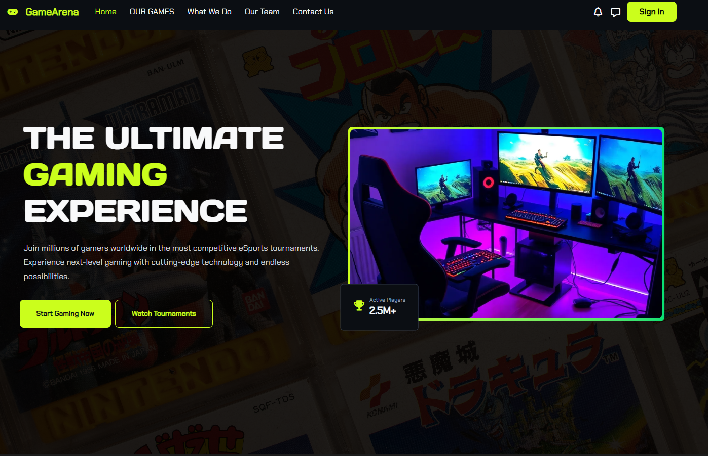
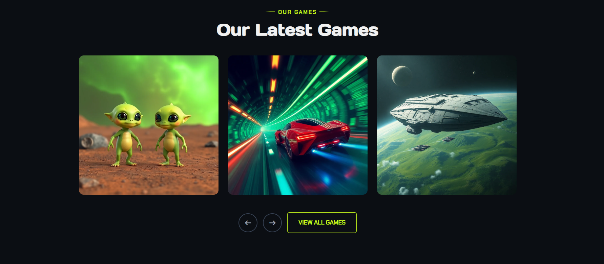
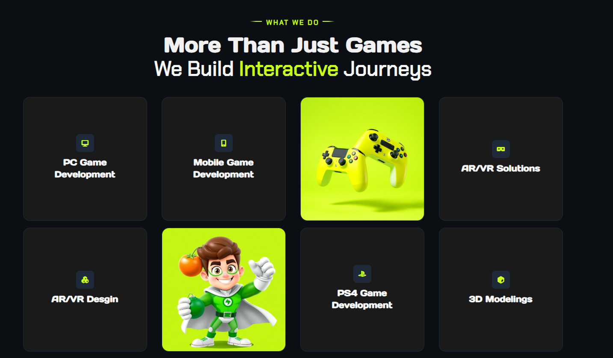
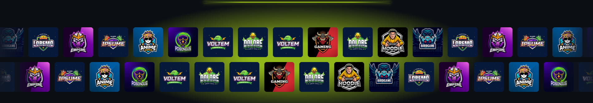
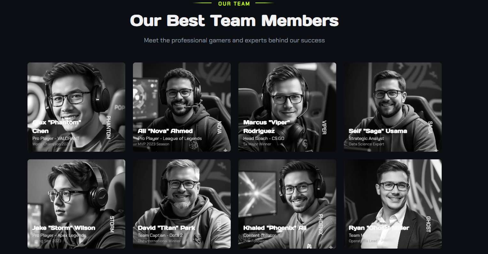
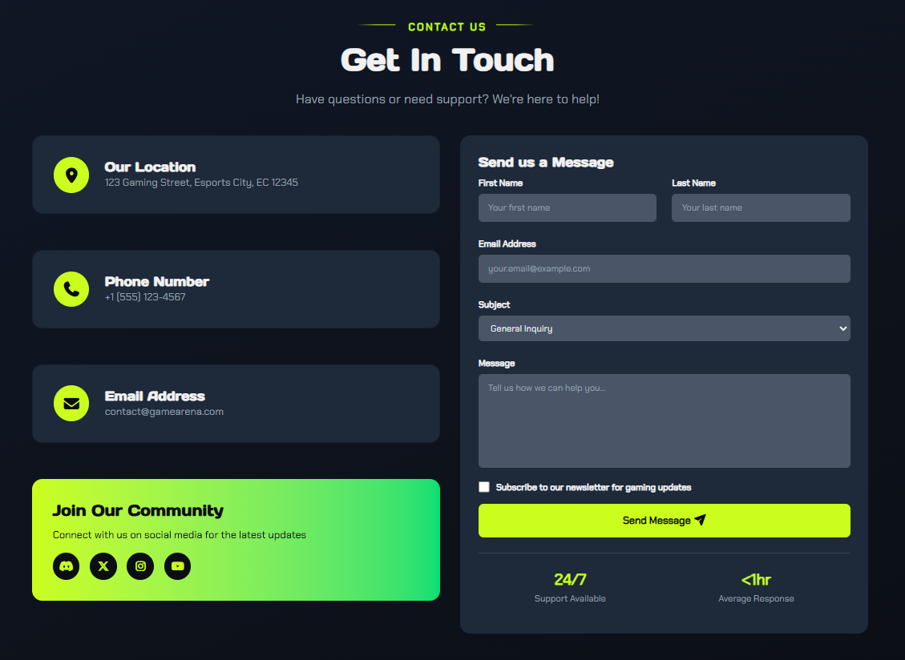
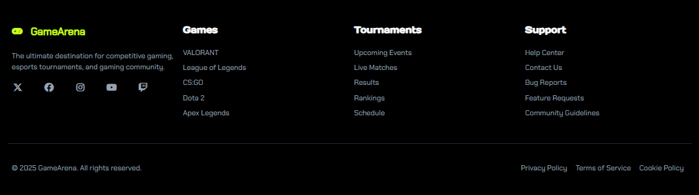

# GameArena Landing Page

## 🚀 Project Overview
**GameArena** is a modern, interactive gaming platform website that showcases the latest games, esports tournaments, and community features. It features sections such as "Our Games," "What We Do," "Our Team," and a contact form for visitors.

The site is styled for a dynamic gaming-brand feel, with strong visuals, hero banners, metrics (e.g., 2.5M+ active players), and various game categories.  
[Live Demo]([https://abdalla20736.github.io/Game-Arena-Landing-Page/](https://abdalla20736.github.io/Game-Arena-Landing-Page/))

## ✨ Features
- Hero section with headline: _“THE ULTIMATE GAMING EXPERIENCE”_ and CTA buttons.  
- Showcase of "Our Latest Games" with categories:
  - Adventure Multiplayer
  - Racing Sci-Fi
  - RPG Fantasy
  - Shooter Co-op
  - Football Fantasy
  - Space Exploration
- "What We Do" section summarizing game development services:
  - PC Games
  - Mobile Games
  - AR/VR Experiences
  - 3D Modelling
- "Our Team" section listing team members, e.g., Alex "Phantom" Chen – Pro Player, Ali "Nova" Ahmed – MVP, etc.
- Contact section with address, phone, email, newsletter subscription, and social links.
- Responsive, clean, and modern UI.

## 🛠 Tech Stack & Setup
- **Frontend:** HTML, CSS, Bootstrap
- **Responsive Design:** Optimized for multiple screen sizes
- **Assets:** High-quality images for game thumbnails/hero banners
- **Contact Form:** Client-side UI (can integrate with backend or form service)
- **Version Control:** GitHub

## 🖼 Screenshots
Here’s a quick preview of the website:

**Hero Section**  

**Our Latest Games**  

**More Than Just a Game Section**  

**Animated Slider**  

**Our Team Section**  

**Contact Us Section**  

**Footer**  

